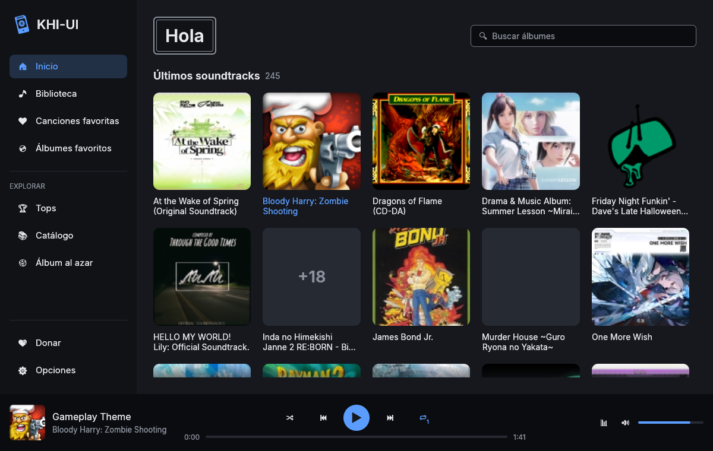
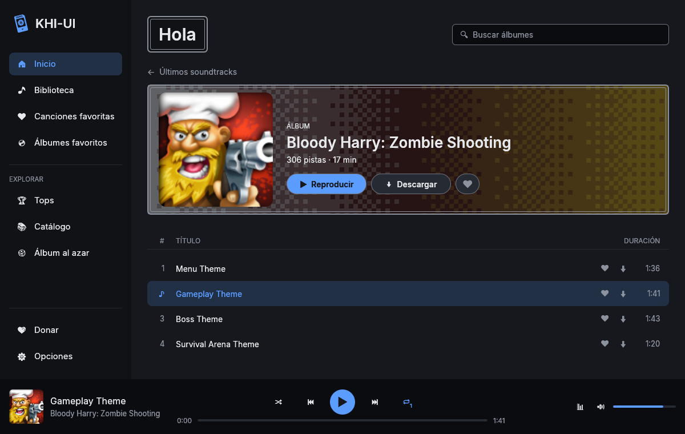
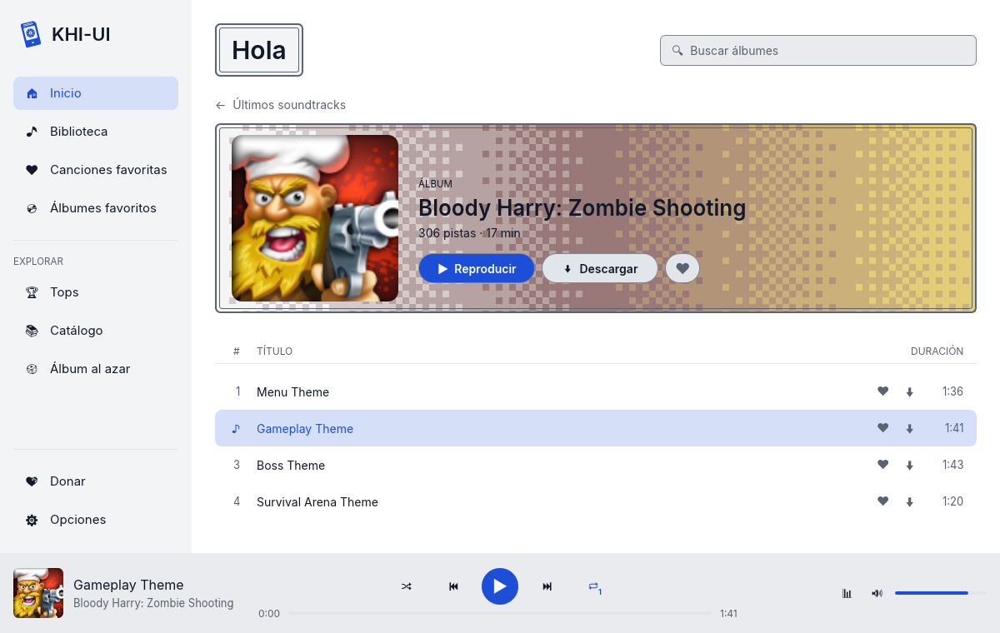

<p align="center"></p>

# KHI-UI

KHI-UI (se dice *kiwi*) es una app de escritorio para escuchar y bajar soundtracks de videojuegos
desde [KHInsider](https://downloads.khinsider.com/). Funciona en macOS, Linux y Windows.



## Qué puedes hacer

- Ver los soundtracks más recientes, los tops y el catálogo completo, o pedir un álbum al azar.
- Escuchar cualquier álbum sin salir de la app.
- Bajar un álbum entero o solo las canciones que te gusten, en MP3 o FLAC.
- Escuchar lo que ya bajaste sin conexión, desde la **Biblioteca**.
- Guardar álbumes y canciones en favoritos. Si inicias sesión con tu cuenta de KHInsider, también
  ves tus playlists.
- Usar la app en español o inglés, con tema oscuro, claro o uno hecho por ti.





## Instalarla

Baja el archivo de tu sistema desde [Releases](https://github.com/dnminutti/khi-ui/releases),
descomprímelo y abre `khi-ui`.

En macOS la app no está firmada, así que la primera vez hay que abrirla con clic derecho y **Abrir**.

## Compilarla tú

Necesitas Rust, `cmake` y `clang`. En Linux también necesitas `libasound2-dev` y `pkg-config`.

```sh
cargo run --release
```

## Temas propios

Copia `themes/claro.toml` a `~/.config/khi-ui/themes/mi-tema.toml`, cambia el nombre y los colores, y
reinicia la app. Los colores usan los mismos nombres que [Catppuccin](https://catppuccin.com/palette),
así que puedes copiar cualquiera de sus paletas.

## Antes de iniciar sesión

La contraseña de KHInsider se guarda sin cifrar en `~/.config/khi-ui/password`. Solo tu usuario del
sistema puede leer ese archivo. Las cuentas con verificación en dos pasos no funcionan todavía.

## Apoya a KHInsider

La música viene de KHInsider. Si la app te sirve, considera
[donar al equipo de KHInsider](https://downloads.khinsider.com/forums/index.php?account/upgrades).
